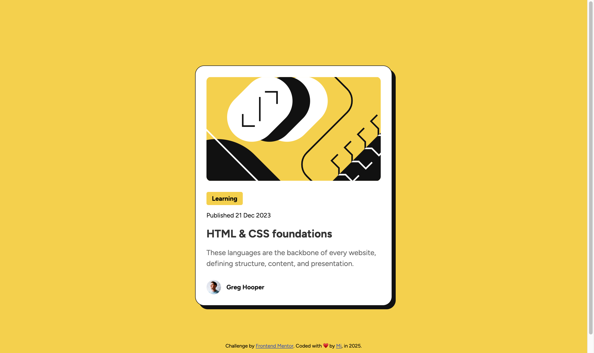

# Frontend Mentor - Blog preview card solution

This is a solution to the [Blog preview card challenge on Frontend Mentor](https://www.frontendmentor.io/challenges/blog-preview-card-ckPaj01IcS). Frontend Mentor challenges help you improve your coding skills by building realistic projects. 

## Table of contents

- [Overview](#overview)
  - [The challenge](#the-challenge)
  - [Screenshot](#screenshot)
  - [Links](#links)
- [Author](#author)

**Note: Delete this note and update the table of contents based on what sections you keep.**

## Overview

### The challenge

Users should be able to:

- See hover and focus states for all interactive elements on the page

Blog preview card
This HTML & CSS-only challenge is a perfect project for beginners getting up to speed with HTML and CSS fundamentals, like HTML structure and the box model.

### Screenshot

### Links

- Solution URL: [https://github.com/mileine/frontendmentor-blog-preview-card](https://github.com/mileine/frontendmentor-blog-preview-card)
- Live Site URL: [https://frontendmentor-blog-preview-card-omega.vercel.app/](https://frontendmentor-blog-preview-card-omega.vercel.app/)

## Author

- Frontend Mentor - [@mileine](https://www.frontendmentor.io/profile/mileine)
- Instagram - [@tao.da.mi](https://www.twitter.com/yourusername)
